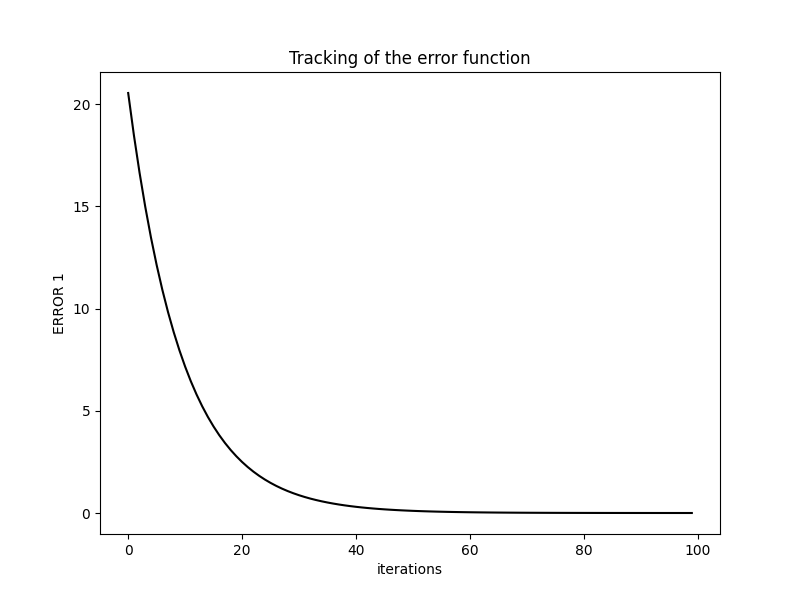
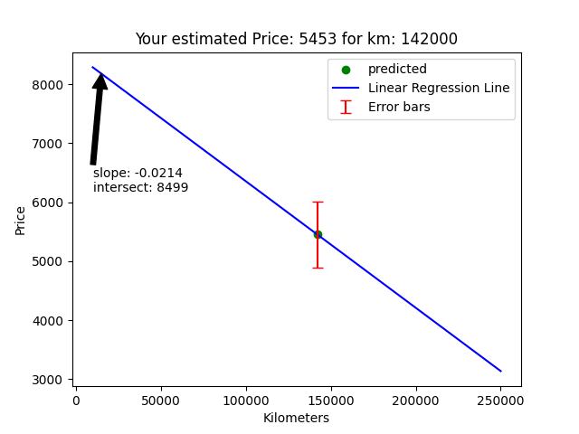
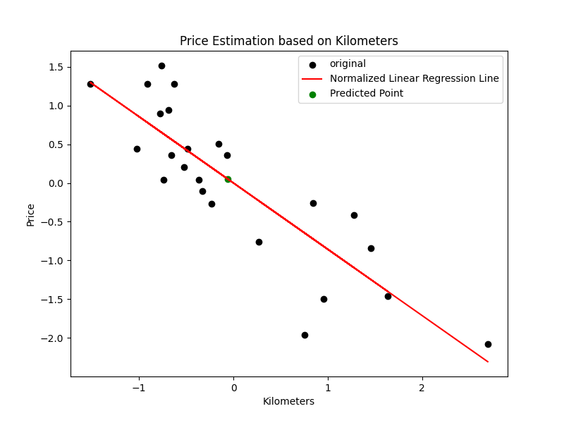
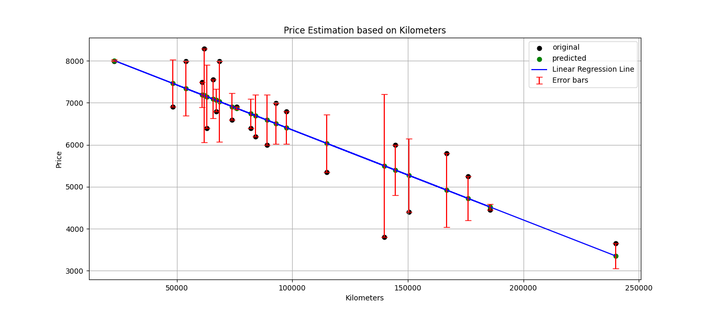

## linear_regression
### Summary: In this 42 mastery project, I implement my first machine learning algorithm.
>“A computer program is said to learn from experience E with respect to some
>class of tasks T and performance measure P, if its performance at tasks in
>T, as measured by P, improves with experience E.”
>
>Tom M. Mitchell

`The aim of this project is to introduce you to the basic concept behind machine learning.
For this project, you will have to create a program that predicts the price of a car by
using a linear function train with a gradient descent algorithm.`

Use of programs.
To train the modell: run the train_model.py (e.g: python3 train_model.py)

To predict any price: run the predict_price.py (e.g: python3 predict_price.py)
You will be prompt for a number. then a graph will show you your prediction.

results:
>Plotting one of the error fromt he training modell what is using gradient descent.

>Fitting to the Normalised dataset.

>Fitting to the original dataset.

>Fitting to the original dataset fit error.
